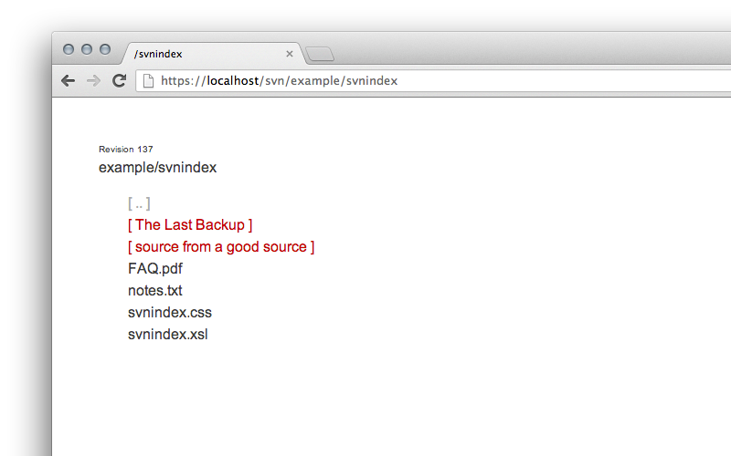

# Simple SVNIndex

A **simplified** version of the sample XML transformation style sheet for displaying the Subversion directory listing that is generated by *mod_dav_svn* when the `SVNIndexXSLT` directive is used.

## Screenshot

## History

- **25.06.2013** init
